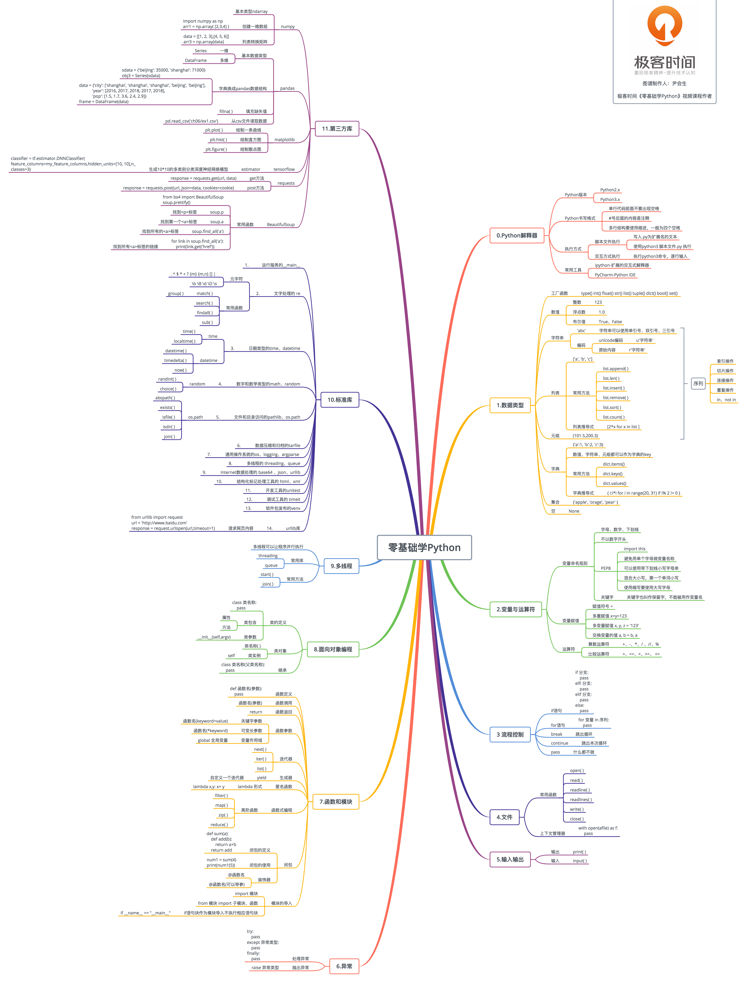
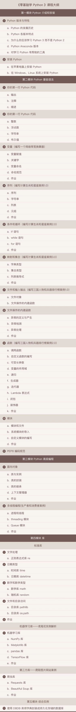

# 极客时间python 

### Python学习思维导图

### Python PEP8 编码规范
https: // www.python.org / dev / peps / pep - 0008/  

pycharm 安装PEP8  
cmd窗口输入：pip install autopep8  
Tools→Extends Tools→点击加号  

Name：Autopep8（可以随便取）  
- Tools settings:
    - Programs：`autopep8` （前提是你已经安装了哦）  
    - Parameters: `--in-place - -aggressive - -aggressive $FilePath$`  
    - Working directory: `$ProjectFileDir$`  
- 点击Output Filters→添加，在对话框中的：Regular expression to match output中输入：`$FILE_PATH$\: $LINE$\: $COLUMN$\: .*`  

### Python 日常应用比较广泛的模块
1. 文字处理的 re
2. 日期类型的time、datetime
3. 数字和数学类型的math、random
4. 文件和目录访问的pathlib、os.path
5. 数据压缩和归档的tarfile
6. 通用操作系统的os、logging、argparse
7. 多线程的 threading、queue
8. Internet数据处理的 base64 、json、urllib
9. 结构化标记处理工具的 html、xml
10. 开发工具的unitest
11. 调试工具的 timeit
12. 软件包发布的venv
13. 运行服务的__main__

### Python机器学习
pip3 install numpy  
which python3  
把结果路径/usr/local/bin/python3导入   
File - Default Settings- Project InterPreter 和 Run - Edit Configurations- Project InterPreter  
pip3 install pandas   
pip3 install matplotlib  

### 按章节分类的课上演示代码 

### 课程目录

